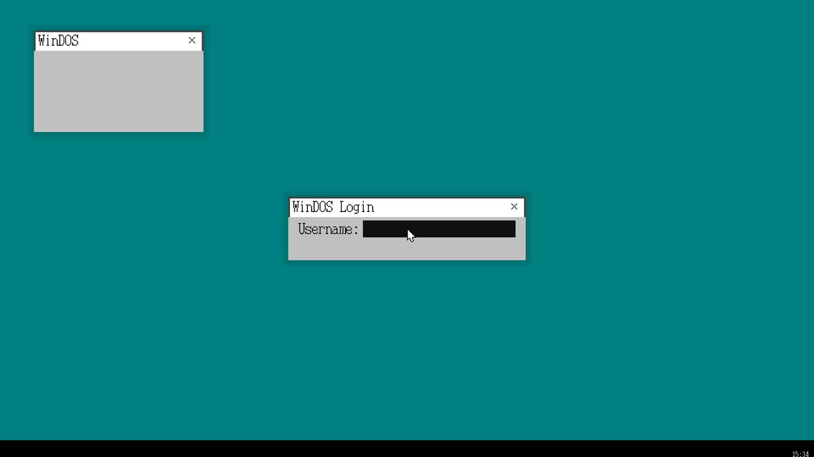

# WinDOS

> 从零写起的 **UEFI 64 位自制操作系统**：Rust 引导器 + C++ 内核，目前跑在 QEMU/OVMF 上。
> 血统属于《30天自制操作系统》（haribote）那条线，但代码是 64 位重写；旧版本（BIOS + 软盘镜像）存档在 **[WinDOS-Legacy](https://github.com/boonxiong2/WinDOS-Legacy)**。



*1920×1080 · 图层窗口 + 半透明阴影 · 登录界面 · 底部任务栏与时钟（UEFI GetTime + PIT 累加）· 软件光标*

## 现在能跑什么（都实测过，附判据）

| 能力 | 状态 / 怎么确认 |
|---|---|
| UEFI 启动 → 读内核 | 引导器从 ExFAT 的 `memdisk.img` 里解析出 `KERNEL.BIN` 加载（**不内嵌内核**） |
| 固件交接 | `GetMemoryMap(0x38) → ExitBootServices(0xE8, 真 ImageHandle, MapKey) + 有界重试 → cli`；日志 `EBS OK` |
| 设备发现 | 问 UEFI「我从哪块盘来」（`LoadedImage → DeviceHandle → DevicePath`）→ 控制器类型 / PCI 位置 / 分区起始 LBA 写进 `BootInfo` —— **不猜盘、不硬编码 dev 号** |
| 显示模式 | 自己 `SetMode` 挑 **1920×1080**（只接受"恰好"该尺寸，绝不选更大——缓冲区是按 FHD 开的） |
| 图形 | 图层系统（sheet 移植）+ 半透明阴影（合成减）+ 窗口拖动 / 关闭 + 软件光标 + 任务栏时钟 |
| 用户态 | 登录 → `sysret` 进 **Ring3** → `syscall` 回内核（`SYS_WRITE` 已通）；`info registers` 里 `CPL=3 / CS=002b / SS=0023` |
| 安全模型 | `IOPL=0` + `UMIP`（CPUID 门控）+ IDT 页 `US=0` + syscall 指针校验（上界按 `_bss_end` 推导，不写死 8MB） |
| 崩溃处理 | Win11 风格黑屏 + **崩溃处理自身安全**（防重入 + 显存指针合法性检查，不可信时只打串口不画屏） |
| 存储 | ATA PIO 真盘 **读 + 写**：读出 FAT 引导扇区 `"MSWIN4.1"`；签名盘写扇区并读回 = `WRITE_OK` |
| 绘制基元 | `sys/draw.h` 带裁剪的 fill / blit / text + **哨兵自检**（启动日志 `[DRAW] selftest PASS`） |

## 快速开始

**依赖**

- `clang` / `lld`（LLVM，带 `x86_64-elf` 目标）、`llvm-objcopy`
- **rustc 1.90.0** —— 引导器用 `cargo build --target x86_64-unknown-uefi`；更新的小版本会让固件崩（原因写在避坑手册里）
- Python 3 —— 生成 ExFAT 镜像用（`tools/mkmemdisk.py`）
- QEMU + OVMF：`OVMF.fd` 放在**仓库同级目录**（`run.bat` 里按需改路径）

**编译**

```bat
build.bat
```

它做的事：编 C++ 内核 → `llvm-objcopy` 出 `kernel/kernel.kern` → 调 `tools/mkmemdisk.py` 生成 `esp/memdisk.img`（ExFAT，内含 `KERNEL.BIN`，带 256KB 上限护栏）→ `cargo build` 引导器 → 拷成 `esp/EFI/BOOT/BOOTX64.EFI`。

**运行**

```bat
run.bat
```

或手动：

```bat
qemu-system-x86_64 -m 512 -bios ..\OVMF.fd ^
  -drive file=fat:rw:esp,format=raw,if=none,id=esp ^
  -device ide-hd,drive=esp,bootindex=1
```

登录：输入任意用户名（`Sysdebug` 是 Ring1 的遗留路径）+ 回车 → 进 Ring3，内核会把 `HELLO FROM RING3` 打到 COM1。

## 目录结构

```
src/main.rs          UEFI 引导器（Rust）：找盘 / 读内核 / EBS / 选分辨率 → 跳内核
kernel/kernel.cpp    内核主体：启动序列、图层窗口、登录、Ring3、syscall 分发
kernel/sys/          gdt idt isr ps2 draw fill exception panic log stdkern …
kernel/window/       图层系统（sheet）+ 光标定义
kernel/fs/           exfat（读 ✓ / 写半成品）、ata（PIO 读+写）、nvme（未通）、memdisk
kernel/drivers/      io（端口 I/O，**必须 volatile**）、font（8×16 点阵）、mouse serial pid
kernel/security/     死屏（BSOD）
tools/mkmemdisk.py   生成 esp/memdisk.img（ExFAT + KERNEL.BIN）
docs/                内核避坑手册.md、截图
IDEAS.md             路线图 + Bug Reports
```

## 还没做（诚实清单）

- **ExFAT 写**还不完整：缺 `SetChecksum` / `NameHash` 等字段、只支持单簇、只写根目录、位图只写一扇区
- **USB / xHCI 完全没有**：插 U 盘用不了；运行中插入设备"完全无感"；真机上这意味着 USB 键鼠也点不动
- **NVMe** 未通（PCI 读的那个坑已修，待重试 64 位 BAR）
- 无 SMP / APIC / ACPI（单核 + 8259 PIC）；无 FAT32 驱动；无 VFS / 进程抽象
- 真机移植项（Secure Boot 签名、看门狗、显存像素格式、4K 防越界、USB HID…）清单见 `docs/内核避坑手册.md §7`
- UI：任务栏与时钟仍是 1×（其余已按 `UI_SCALE=2` 放大）

## 文档

- **`docs/内核避坑手册.md`** —— 出问题时的第一张表。每条都写成「**现象（日志长什么样）→ 根因 → 改哪几行 → 验收判据**」，包含 UEFI 表偏移、EBS 正确序、clang -O2 陷阱清单、端口 I/O volatile、Ring3/GDT、ATA PIO 配方、真机清单等
- **`IDEAS.md`** —— 路线图（`[+]` 完成 / `[-]` 部分 / `[ ]` 未开始）+ Bug Reports

## 血统与致谢

- 图层、多任务那套设计源自 **《30天自制操作系统》（川合秀実）的 haribote**；本项目是它的 64 位重写
- 旧版本（BIOS + 软盘、32 位 C 内核、中文字库、文件管理器）存档 → **[WinDOS-Legacy](https://github.com/boonxiong2/WinDOS-Legacy)**（附可直接启动的软盘镜像）
- 名字是玩笑：`Win` 致敬 Windows、`DOS` 调侃历史包袱 —— 跟微软没有任何关系（这点不用声明也知道吧 😄）
- 还有一句自黑留在这儿：[README.txt](README.txt)
